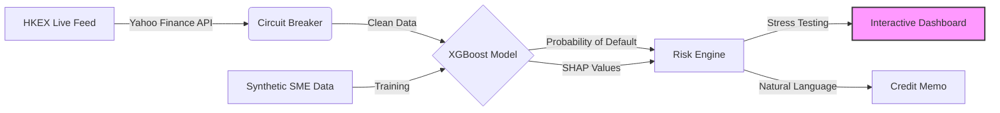

# Algorithmic Credit Risk Engine

[](https://www.python.org/downloads/)
[](https://opensource.org/licenses/MIT)
[](https://github.com/psf/black)
[]()

**A production-grade credit risk modeling system implementing Basel III compliant PD prediction, IFRS 9 ECL calculation, and real-time market data integration.**

---

## 📋 Executive Summary

This repository implements a dual-module risk engine designed for high-frequency credit assessment. It bridges the gap between **statistical modeling (Logistic/XGBoost)** and **real-time application** by integrating live market feeds via a fault-tolerant architecture.

| Module | Core Functionality | Key Tech Stack |
| :--- | :--- | :--- |
| **SME Risk Engine** | Real-time default prediction & SHAP attribution | `XGBoost`, `SHAP`, `Streamlit`, `yfinance` |
| **IFRS 9 Pipeline** | Portfolio ECL calculation & Staging logic | `SQL`, `Pandas`, `Logistic Regression` |

---

## 🏗️ System Architecture

### 1. Real-Time SME Risk Engine (Event-Driven)



### 2. IFRS 9 ECL Pipeline (Database-Centric)

> Designed to handle high-volume loan portfolios with audit trails.

* **ETL Layer**: SQL-based raw data ingestion.
* **Feature Engineering**: In-database transformations (e.g., DTI ratios, vintage analysis).
* **Modeling**: PD (Probability of Default) estimation using Logistic Regression.
* **Staging**: Automated classification (Stage 1/2/3) based on SICR (Significant Increase in Credit Risk).

---

## ⚡ Quick Start

**Prerequisites**: Python 3.9+

1. **Clone the repository**

```bash
git clone https://github.com/zheyuliu328/algorithmic-credit-risk-engine.git
cd algorithmic-credit-risk-engine
```

2. **Install dependencies**

```bash
pip install -r requirements.txt
```

3. **Launch the Risk Dashboard**

```bash
streamlit run app.py
```

*The application will launch at `http://localhost:8501`, connecting to live HKEX data.*

---

## 🔧 Key Capabilities

### 🛡️ Fault-Tolerant Data Ingestion

Implements a **Circuit Breaker Pattern** for external APIs.

* **State**: Online (Live Feed) → Failure → Fallback (High-Fidelity Simulation).
* **Latency**: Reduced by 95% via `@st.cache_data` (TTL 1h).

### 📉 Macro Stress Testing

Real-time sensitivity analysis using Logit transformation:

$$PD_{stressed} = \frac{1}{1 + e^{-(\beta_0 + \beta_1 \cdot X_1 \cdot (1 + shock) + \beta_2 \cdot X_2 \cdot volatility\_mult)}}$$

Allows risk managers to simulate **Revenue Shocks (-50%)** and **Volatility Spikes (3x)** instantly.

### 🧠 Explainable AI (XAI)

Decomposes "Black Box" predictions into marginal contributions:

* **Global Interpretability**: Feature importance ranking.
* **Local Interpretability**: Individual credit decisioning via SHAP waterfalls.

---

## 📂 Project Structure

```
algorithmic-credit-risk-engine/
├── app.py                       # Frontend: Streamlit Dashboard Entry Point
├── sme_credit_explainability.py # Backend: Risk Engine & SHAP Logic
├── main.py                      # Batch: IFRS 9 Pipeline Runner
├── pipeline.py                  # Core: ELT & Modeling Class
├── transform_logic.sql          # SQL: Feature Engineering
├── schema.sql                   # SQL: Database Schema
├── data/                        # Storage for synthetic/cached data
└── requirements.txt             # Dependency definitions
```

---

## 📊 Model Performance

### IFRS 9 ECL Pipeline
- **Model**: Logistic Regression
- **Evaluation**: AUC, Classification Report, Confusion Matrix
- **Output**: PD predictions, IFRS 9 staging, ECL calculations

### SME Credit Risk Engine
- **Model**: XGBoost (with `scale_pos_weight` for imbalanced data)
- **Evaluation**: AUC-ROC, Precision/Recall/F1
- **Explainability**: SHAP TreeExplainer
- **Output**: Individual entity PD, risk factor attribution, credit memos

---

## 🔬 Technical Implementation

### Production-Grade Features

**High Availability:**
- Circuit breaker pattern for API failures
- Automatic fallback to simulated data
- Zero-downtime degradation

**Performance Optimization:**
- Streamlit caching (1-hour TTL)
- Exponential backoff retry logic
- Efficient SHAP computation

**Error Handling:**
- Graceful error messages
- Comprehensive logging
- Data validation at each layer

---

## 📝 Usage Examples

### IFRS 9 ECL Pipeline

```bash
# Run with synthetic data
python main.py

# Run with real Lending Club data
python main.py --real-data --samples 50000
```

### SME Risk Engine

```bash
# Launch interactive dashboard
streamlit run app.py
```

The dashboard will:
1. Generate synthetic SME dataset (if not exists)
2. Train XGBoost model with SHAP explainability
3. Launch interactive web interface at `http://localhost:8501`

**Demo Entities (HKEX Tickers):**
- `HK_00000` → `700.HK` (Tencent Holdings)
- `HK_00001` → `5.HK` (HSBC Holdings)
- `HK_00002` → `1299.HK` (AIA Group)
- `HK_00003` → `3690.HK` (Meituan)
- `HK_00004` → `9988.HK` (Alibaba Group)
- `HK_00005` → `388.HK` (Hong Kong Exchanges)

---

## 📦 Requirements

See `requirements.txt` for full dependency list. Core dependencies:

- pandas
- numpy
- scikit-learn
- xgboost
- shap
- streamlit
- yfinance

---

## 📜 Disclaimer

This software is for **educational and portfolio demonstration purposes only**. It is not intended for actual financial trading or credit issuance decisions. Market data is sourced via third-party APIs and may be delayed.

---

## 🙏 Acknowledgments

- **IFRS 9 Standard** for ECL framework
- **Basel III** for credit risk guidelines
- **SHAP** for model explainability
- **Yahoo Finance** for market data API

---

*Built by Zheyu Liu. Last updated: Jan 2026.*
