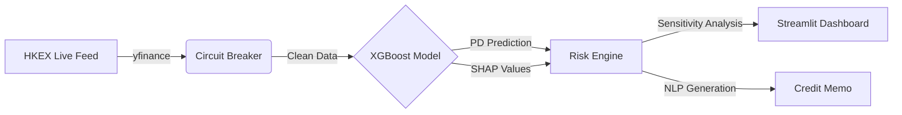

# Algorithmic Credit Risk Engine

[](https://www.python.org/downloads/)
[](https://opensource.org/licenses/MIT)
[](https://github.com/psf/black)

**Production-grade credit risk system implementing Basel III compliant PD prediction with real-time HKEX market data integration.**

Designed for high-frequency credit assessment, bridging statistical modeling (XGBoost/Logistic) with event-driven architecture.

---

## ⚡ Quick Start

```bash
# 1. Install dependencies
pip install -r requirements.txt

# 2. Launch Real-Time Risk Dashboard (SME Engine)
streamlit run app.py
# -> Opens http://localhost:8501

# 3. Run IFRS 9 Pipeline (Batch Processing)
python main.py
```

---

## 🧩 Core Modules

| Module | Engine | Key Features |
| --- | --- | --- |
| **SME Risk Engine** | `XGBoost` + `SHAP` | • **Live Data**: Real-time HKEX feeds via Yahoo Finance.<br><br>• **Stress Testing**: Interactive macro-shock simulation.<br><br>• **Circuit Breaker**: Fault-tolerant API degradation. |
| **IFRS 9 Pipeline** | `Logistic Regression` | • **SQL-Native**: ETL & Feature Engineering in SQL.<br><br>• **Basel III**: Automated Stage 1/2/3 classification.<br><br>• **Audit Trail**: Database-centric architecture. |

---

## 🏗️ Architecture

**Event-Driven Risk Engine (SME Module)**



---

## 📂 Repository Structure

```
.
├── app.py                       # Frontend entry point (Streamlit)
├── sme_credit_explainability.py # Risk Engine Core (XGBoost + SHAP)
├── main.py                      # IFRS 9 Pipeline Runner
├── pipeline.py                  # Data Pipeline Class
├── transform_logic.sql          # SQL Feature Engineering
└── requirements.txt             # Project dependencies
```

---

## 🛡️ Disclaimer

For educational and portfolio demonstration purposes only. Market data is sourced via third-party APIs and may be delayed.

---

*Built by Zheyu Liu.*
